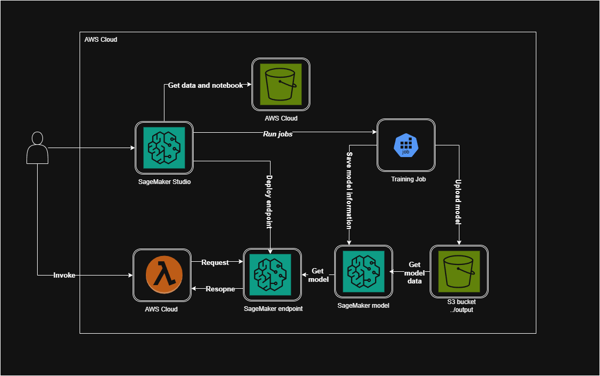

# AWS Anomaly Detection

This project uses **Amazon SageMaker**, **AWS Lambda**, and **Amazon S3** to:

- Explore data  
- Train a model using the **Random Cut Forest (RCF)** algorithm  
- Deploy a prediction endpoint  
- Test it with AWS Lambda  

Let's look at the diagram for a holistic view of the architecture:



---

## ✅ Key Steps

- Set up **Amazon SageMaker Studio**
- Perform EDA using **pandas**, **NumPy**, and **Matplotlib**
- Train and evaluate a model
- Deploy an Amazon SageMaker endpoint
- Configure an AWS Lambda function to test the endpoint

---

## 1. IAM Role Configuration for AWS Lambda

Steps:

1. Go to the **IAM** console  
2. Create a new role (e.g., `lambda-endpoint`)  
3. Attach the following policy:  
   - `AmazonSageMakerFullAccess` *(or minimally, `SageMakerInvokeEndpoint`)*  

---

## 2. S3 Bucket Setup

Create a new S3 bucket with a globally unique name.

**📁 Folder Structure:**

```
s3://{your-bucket-name}/anomaly-detection/data/
s3://{your-bucket-name}/anomaly-detection/rcf-benchmarks/
```

---

## 3. SageMaker Studio Setup

1. Go to **Amazon SageMaker** in the AWS Console  
2. Click **Admin configurations** → **Set up SageMaker Domain** (use **Quick setup**)  
3. Wait until **Status** is `InService`  
4. Open the domain by clicking its name  
5. Add a user and click **Launch** → **Studio**  
6. Once Studio is ready, click **JupyterLab**  
7. Upload `anomaly_detection.ipynb`  
8. ⚠️ *Before running all cells, make sure the last cell (that deletes the endpoint) is commented out*

---

## 4. Lambda Function Setup

1. Go to **AWS Lambda**  
2. Click **Create function**  
   - Runtime: `Python 3.12`  
   - Permissions: **Use existing role** → `lambda-endpoint`  
3. In the **Code Source** section, paste the contents of `lambda_function.py`  

### Runtime Settings

- Scroll to **Runtime settings**  
- Click **Edit**  
- Set **Handler** to: `lambda_function.lambda_handler`  
- Click **Save**

---

You can now test the deployed endpoint using the Lambda function.
